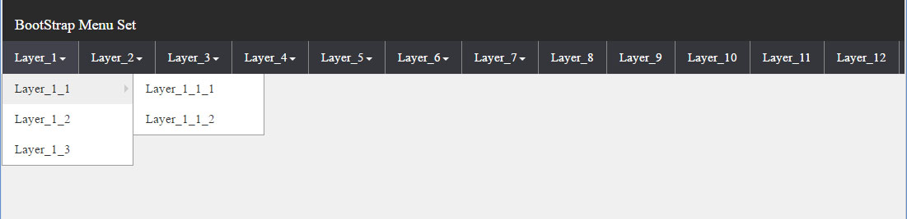
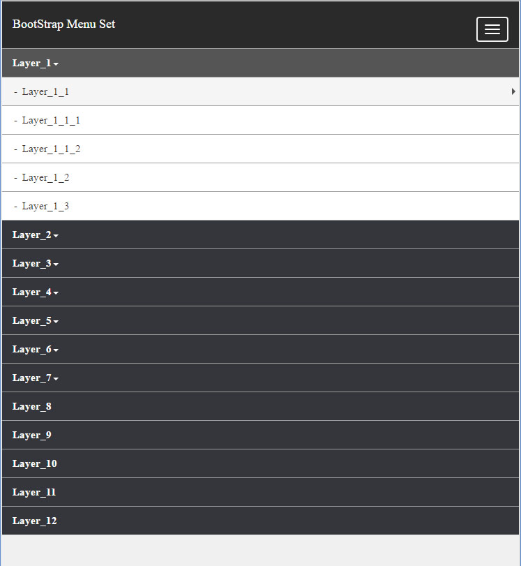

# BootStrap dynamic building tree menu

###Three Step make a menu for your prototype,

*	first off: giv your root `<ul>` a ID **nav_menu_set**.
*	Next Step: import **menuMaker.js** after your `<ul>` tag.
*	Last one: find out **var data = ....** at bottom and started to make up your menu.

##Attention
  Browser test:
  * Chrome: OK!
  * Firefox: OK!
  * EDGE: OK!
  * IE: NO!(ps)

  ! PS: I use es6 templat style to make JSON data, so it does not work on IE browser. if you want to support IE, replace es6 template format to normal style like '{"name":"MenuList","start":[{"name":"Layer_1","url":"","menu":[{"name":"Layer_1_1","url":""......', with no space, no break line then it can support IE too.
  
JSON format

    {
      "name": "MenuList",
      "start": [
        {
        .....
        }
      ]
    }
Setup your menu inside **"start"** tag.

If menu have sub layer, did not give any hyperlink to URL, leave it empty. 
Exp:

    ........
    {
    "name": "Layer_1",
      "url": "", //empty
      "menu": [
        {
          "name": "Layer_1_1",
          "url": "", //empty
          "menu": [
            {
              "name": "Layer_1_1_1",
              "url": "#",
              "menu": [
                
              ]
            },
    .........
    
If is last layer, you can set url to **#** or any link you want.
Exp:

    ........
    {
    "name": "Layer_1",
      "url": "",
      "menu": [
        {
          "name": "Layer_1_1",
          "url": "",
          "menu": [
            {
              "name": "Layer_1_1_1",
              "url": "#", //SET # IF IS LAST LAYER
              "menu": [
                
              ]
            },
            {
              "name": "Layer_1_1_2",
              "url": "#", //SET # IF IS LAST LAYER
              "menu": [
                
              ]
            }
          ]
    .........

###Photo
**Menu widescreen**

**Mobile Device** 

[Prototype tree menu][1]

[1]: http://horkenw.github.io/bootstrapMenu/ "Prototype tree menu"
